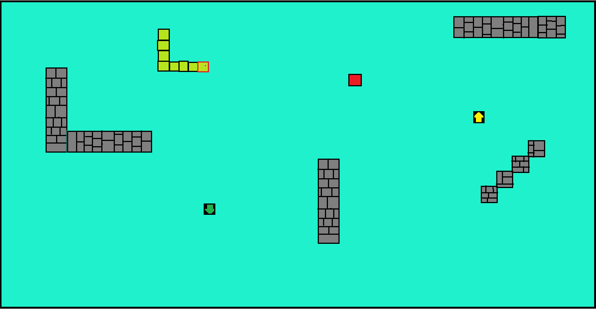

# Gra
Moim pomysłem na projekt końcowy z informatyki będzie gra na wzór "Snake".
W grze będziemy sterować wężem, który będzie stawał się dłuższy w momencie
zjedzenia "owocu". Owoc będzie pojawiał się na planszy w losowo wybranym miejscu.
Ilość zebranych owoców będzie wyznacznikiem uzyskanego wyniku.
Gra będzie wzbogacona o różnego rodzaju tekstury. Sama mapa będzie wyposażona w elementy ścian (jak już wspomniane wyżej), na których wąż może utracić swoje punkty zdrowia w momencie uderzenia.
Gad będzie sterowany za pomocą strzałek na klawiaturze.

# Makieta

* Owoc - 
